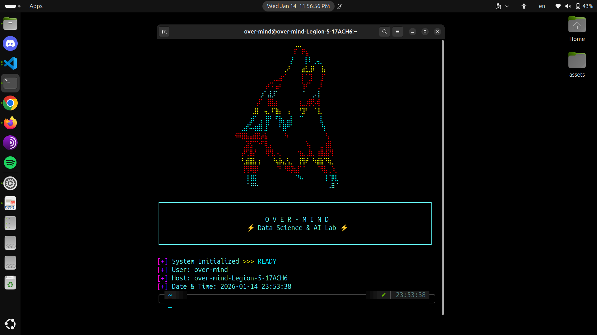

# Over-Mind Terminal Banner

A single-script terminal intro that splashes a neon, cyberpunk logo, glitch animation, and live system metadata whenever you launch a shell session for Over-Mind demos or recordings.

## Preview



## Features

- 256-color `bash` animation with random neon hues and centered ASCII art.
- `NAME` plate rendered below the logo and a stylized title card highlighting the lab mission.
- Spinner-style status sequence followed by user, host, and timestamp metadata.
- Strict mode (`set -euo pipefail`) plus traps to keep colors reset on exit.

## Requirements

- `bash` (v4+) on Linux/macOS.
- `tput` (comes from `ncurses`) to measure the terminal width.
- A 256-color compatible terminal for the cyan/pink/yellow palette.

## Installation & Usage

```bash
git clone <repo>
cd Over-Mind-Terminal
chmod +x overmind_banner.sh
./overmind_banner.sh
```

Stub the script into your shell startup (e.g., `~/.bashrc`, `~/.profile`, or the Welcome hook in a multiplexer) to display the banner automatically when a session starts.

Pair it with `~/bin` or a launcher so demos always start with the same cinematic intro.

## Customization

- Edit the `LOGO` and `NAME` arrays to change the ASCII art or brand statements.
- Adjust `COLOR_PALETTE` or the `frames` array in `status_sequence()` to fine-tune colors and the system readiness animation.
- Use `center_text` and `get_indent` as templates when adding new text blocks so the art re-centers automatically.

## Contribution

Open a pull request for additions such as new variants (e.g., dark mode, custom prompts, or additional metadata). Keep terminal compatibility in mind when introducing new glyphs or escape sequences.

## License

This project is released under the MIT License. See `LICENSE` for details.
