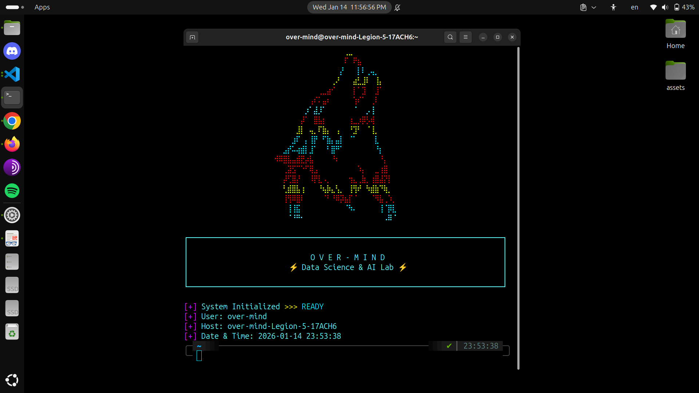

# Over-Mind Terminal

Professional terminal startup banners for the Over-Mind project, with two visual themes:

- `overmind_banner_neon.sh` (Neon/Cyberpunk style)
- `overmind_banner_Goku.sh` (Goku style)

## Run Banner (Top Command)

```bash
sh overmind_banner_neon.sh
```

You can also run:

```bash
sh overmind_banner_Goku.sh
```

## Project Logo: Over-Mind Terminal




## Recommended Image + Script Pairing

| Preview Image | Recommended Script |
| --- | --- |
| `assets/1.jpg` | `overmind_banner_neon.sh` |
| `assets/2.jpg` | `overmind_banner_neon.sh` |
| `assets/3.png` | `overmind_banner_Goku.sh` |

## Features

- Animated terminal banners with centered ASCII branding.
- Theme-specific visual identity for demos, recordings, and startup sessions.
- Shell-friendly scripts for quick execution.
- Color reset handling to keep terminal output clean after execution.

## Requirements

- Linux or macOS terminal.
- `bash` (v4+ recommended).
- `tput`/`ncurses` support for terminal width and color behavior.

For full dependency and platform install details, see [REQUIREMENTS.md](REQUIREMENTS.md).

## Installation

```bash
git clone https://github.com/Over-Mind1/Over-Mind-Terminal.git
cd Over-Mind-Terminal
chmod +x overmind_banner_neon.sh overmind_banner_Goku.sh
```

## Usage

Run Neon banner:

```bash
./overmind_banner_neon.sh
```

Run Goku banner:

```bash
./overmind_banner_Goku.sh
```

To launch automatically at shell startup, add one of the commands to your shell profile (for example `~/.bashrc`):

```bash
sh /path/to/Over-Mind-Terminal/overmind_banner_neon.sh
```

## License

This project is released under the MIT License. See `LICENSE` for details.
